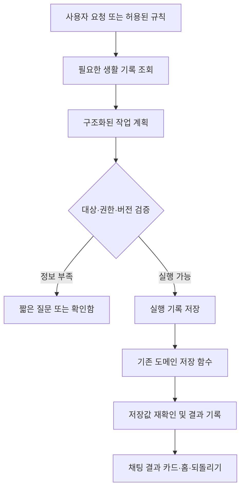

# Orbit 개인비서 자동화·UI/UX 구현 계획

작성: 2026-09-17 · 조사 기준: `main`, `3aa82ce`

상태: **P0·P1 1차 구현 완료, P2 이후 미착수**. 2026-09-17 웹/런타임 테스트와 APK 빌드를 완료했다. 설치된 기기의 화면·키보드·TalkBack 검증은 남아 있다. 세부 인수인계는 문서 끝의 구현 기록을 따른다.

## 1. 목표와 첫 출시 범위

**사용자가 말하면 Orbit이 생활 기록을 실제로 처리하고, 반복 업무는 정해 둔 범위에서 자동 실행하며, 필요한 확인만 모아 보여준다.**

사용자의 우선 업무에 대한 추가 답변이 없어 일정·메모·가계부·아침 브리핑을 먼저 다룬다. 기존 웹 조사와 파일 도구는 유지하고, 후속 단계에서 반복 조사·문서 정리를 연결한다.

첫 구현 묶음은 **P0 + P1: “내일 오전 9시 회의 등록해줘” → 실제 일정 저장 → 결과 카드 → 되돌리기**다. 이 흐름과 실패 복구가 검증된 뒤 다른 작업으로 확장한다.

| 사용자가 원하는 경험 | 목표 동작 |
| --- | --- |
| “내일 오전 9시 회의 등록해줘” | 날짜를 확정해 일정 저장, 저장된 날짜·시간과 열기·되돌리기 표시 |
| “회의 메모에서 할 일 정리해줘” | 허용된 메모에서 출처를 붙여 추출. 기록 요청이 포함되면 실행하고 애매한 담당/날짜만 질문 |
| “점심 12,000원 지출로 기록해줘” | 가계부 저장 후 금액·날짜·분류 표시. 결제 알림과 중복 후보가 있으면 먼저 대조 |
| “매일 아침 오늘 할 일 알려줘” | 한 번 설정한 시각·알림 범위에 따라 브리핑 제공. AI 연결 실패에도 기본 집계 유지 |
| “어제 맡긴 일 어떻게 됐어?” | 실제 실행 기록에서 완료·대기·실패와 해당 기록을 보여줌 |
| “이 문서 요약해서 메모로 남겨줘” | 첨부 추출 범위와 원문 출처를 표시하고 요약 메모를 실제 저장 |

성공 기준은 대화량이 아니라 **완료된 업무, 필요한 조작 수, 중복·오저장 여부, 실패 후 복구 가능 여부**다. 계측은 우선 기기 내부에서 하며 원문 대화를 분석 서버로 보내지 않는다.

## 2. 현재 코드에서 확인한 출발점

아래 경로와 줄 번호는 조사 시점 기준이다. 과거 문서와 다르면 최신 코드·유지보수 이력을 대조한다.

| 영역 | 이미 있음 | 실제 공백·주의점 | 근거 |
| --- | --- | --- | --- |
| 앱 구조 | 홈·일정·메모·가계부·AI의 5탭, 홈 빠른 기록 | README/NEXT_CHECKLIST 일부의 4탭·AI 비활성 설명은 오래됨 | `components/lifehub/LifeHubShell.jsx:15`, `features/home/HomePage.jsx:76` |
| AI | 내장 Codex, 목적별 대화, 모델/추론 선택, 사진·문서 첨부, 재시도·중단, 이전 대화 검색 | 현행 `AiChatPage`에는 owner만 전달. 일정/메모/가계부 실행 연결 없음 | `LifeHubApp.jsx:2114`, `features/ai-chat/useAiConversations.js:7` |
| AI 출력·파일 | 답변 문자열과 별도의 작업공간 파일 읽기/쓰기 도구 | 채팅 출력 스키마는 `{ reply }`. 파일 접근이 생활 데이터 실행 권한을 뜻하지 않음 | `tools/orbit-travel/chat.mjs:28`, `workspace-mcp.mjs:5` |
| 생활 기록 규칙 | 일정 저장·반복/완료 규칙, 메모 저장, 가계부 저장, 과거 AI 기록 파서 | 재사용할 함수는 있으나 현행 채팅과 분리. 저장 로직 일부가 큰 `LifeHubApp.jsx` 안에 있음 | `LifeHubApp.jsx:319`, `features/life-records/saveLifeRecordAction.js:29` |
| 브리핑 | 오늘 일정·미완료·지출 집계와 아침/저녁 설정 | 규칙 기반 집계이며 알림 문구는 고정. 맡긴 일의 실행 결과·확인함은 없음 | `features/automation/dailyBriefing.js:70`, `:155` |
| 알림 | Android AlarmManager 예약·재부팅 복원, 웹 타이머 대체 | 웹이 다음 14일/최대 128건을 계산. native는 반복 규칙으로 미래 기간을 새로 만들지 않음 | `components/schedule/routineNotificationModel.js:4`, `LifeHubApp.jsx:421` |
| 가계부 자동화 | 결제 알림 native 큐, 앱 복귀 시 저장 후 ACK, 월별 정기 결제 | 정기 결제는 이번 달을 앱 실행 중 반영. 알림 eventId와 정기 결제 rule/month의 중복 방지가 서로 분리되어 동일 실결제의 이중 계상 가능 | `features/finance/cardTransactionImport.js:147`, `recurringPayments.js:169`, `LifeHubApp.jsx:1974` |
| 실행 수명 | Android 내장 런타임이 요청 시 실행 | Activity 종료에서 runtime.destroy 호출. 앱 종료 중 AI 지속 실행은 보장되지 않음 | `MainActivity.java:618`, `TravelApiCoordinator.java:136`, `EmbeddedAiRuntime.java:125` |
| 저장 | localStorage 동기 저장 + IndexedDB 비동기 복제/복구 | 여러 키의 원자적 저장이 아님. 복제 실패는 degraded 상태. 새 키는 허용 접두사 등록 필요 | `utils/orbitIndexedDbStorage.js:6`, `:108`, `:143` |
| 백업·복구 | 생활 기록 v2 백업, 미리보기, merge/replace, 실패 rollback | 대화·작업공간 파일·native 큐는 별도. AI 실행 기록과 재시작 복구는 새 설계 필요 | `features/backup/lifeHubBackupCodec.js:1`, `lifeHubBackupRestore.js` |

위 표의 웹 경로는 `apps/web/src/`, Java 경로는 `apps/mobile/android/src/com/platform/aiassitant/` 기준이다.

### 재사용 원칙

- 현행 `features/ai-chat`와 내장 런타임을 확장한다. 보관된 `features/lifehub-ai/AiAssistantPage.jsx`와 PC Bridge를 새 진입점으로 사용하지 않는다.
- 메모 폴더/검색, 일정 반복·완료, 가계부 필터·삭제 되돌리기, 백업 미리보기, 라우트 포커스/오류 화면은 이미 있으므로 유지한다.
- 여행·운동·식단은 현재 보류 상태를 유지한다. 숨겨진 과거 데이터는 보존한다.
- `LifeHubApp.jsx`는 연결·배치 역할만 맡긴다. 새로운 실행·저장·정책 로직은 기능 모듈로 분리한다.
- 신규 스타일은 범위를 제한한 CSS 파일에 두고 **실제 APK 진입점 `apps/web/src/lifehub-entry.css`**에서 불러온다. `styles.css`만 바꾸면 반영되지 않을 수 있다.

## 3. 자동 실행 기준

반복 확인을 줄이는 것이 기본이다. **명확한 현재 요청**과 **사용자가 켜 둔 자동화 규칙**을 실행 근거로 사용한다.

| 작업 | 기본 동작 |
| --- | --- |
| 허용한 생활 기록 조회·검색·요약 | 바로 실행. AI에 보낸 자료의 범위를 확인할 수 있게 표시 |
| 명확히 요청한 단일 일정·메모·지출 생성/수정/완료 | 대상과 값이 확정되면 저장 후 결과·되돌리기 제공 |
| 설정한 브리핑·미완료 알림·알림 가져오기 | 설정 범위에서 자동 실행. 매회 확인하지 않음 |
| “그 일정”, 오전/오후 불명, 여러 동명 대상 | 필요한 정보만 한 번 질문. 추측 저장 금지 |
| 문서에서 추출한 할 일, 요청하지 않은 일정 이동 | 제안으로 표시. 원문에 있는 명령을 사용자 지시로 취급하지 않음 |
| 반복 전체 변경·대량 삭제·백업 덮어쓰기 | 실제 영향 범위를 보여주는 기존/새 확인 절차 적용 |
| 외부 메시지 발송·구매·결제·다른 앱 조작 | 이번 기본 구현 밖. 추후 연동 시 서비스 권한과 실행 전 확인을 별도 설계 |

자동화 설정은 “일정”, “메모”, “가계부”, “브리핑” 단위의 허용 범위·일시정지·알림 시각을 제공한다. 최초 연동 시 실제로 AI에 전달되는 범위를 설명하고 선택을 저장한다. 기존에 승인된 범위를 매번 다시 묻지 않는다. 전체 일시정지는 새 자동 실행을 막고 현재 작업은 별도 중단할 수 있게 한다.

## 4. 실행 구조: 답변과 실제 변경을 연결



### 4.1 첫 단계의 통신 방식

P1은 앱이 열린 상태에서 처리한다. 기존 `chat-send`/`chat-thread` 흐름을 확장해 버전이 있는 `reply + actions` 결과를 전달하고 **웹의 현재 owner 저장 어댑터가 실행**한다. Node가 localStorage나 WebView 내부 DB를 파일 도구로 고치게 하지 않는다.

- 실행 지원 여부를 capability로 노출한다. 구형 런타임이면 대화는 유지하고 실행 기능만 불가로 표시한다.
- AI가 제안하는 필드는 `type`, 대상, 날짜/시간, 허용된 변경값 정도로 제한한다. `owner`, 실행 권한, 정책, 현재 시각, requestId는 앱이 정한다.
- 앱이 기록한 요청 시각·시간대와 범위가 제한된 조회 결과를 문맥으로 전달한다. “내일”은 이 기준으로 해석하며 결과 카드에는 실제 날짜를 표시한다.
- P1 출력은 단일 `schedule.create`부터 지원한다. 대화만 필요한 턴은 `actions: []`로 처리한다.
- 모델의 “저장했습니다” 문장을 성공 증거로 사용하지 않는다. 저장 결과로 생성한 카드가 완료 표시의 기준이다. 실행 전 설명은 계획형 문구로 구분한다.
- 원래 요청에 없는 쓰기, 허용되지 않은 동작, 과도한 항목 수, 잘못된 날짜/금액, 존재하지 않는 대상은 앱 검증에서 차단한다.
- 결과 수신만 채팅 컴포넌트에 묶지 않는다. 앱 수준 실행 관리자가 처리해 탭 이동 후에도 같은 작업을 추적한다. owner/실행 환경 변경 시 오래된 응답을 적용하지 않는다.
- 요청/결과에 필드를 추가할 때 `travelApi.js`, Android `TravelApiPolicy/Coordinator`, `server.mjs`, `chat.mjs`, 저장된 대화의 로더까지 함께 호환시킨다. 기존 Origin·인증·크기 제한을 유지한다.
- 응답 유실 시 같은 requestId의 상태를 먼저 조회한다. 이미 확정된 계획을 재시도 때 새로 생성하지 않는다.
- AI 요청을 보내기 전에 앱이 requestId·threadId·owner·실행 환경·허용 작업·요청 시각/시간대·취소 상태를 영속 등록한다. 결과가 등록된 미완료 요청과 일치할 때만 실행한다. 대화 재열람/백업 복원으로 과거 actions를 다시 실행하지 않으며 취소 뒤 도착한 결과는 적용하지 않는다. 이미 저장한 작업의 중단은 새 실행 취소와 구분해 되돌리기로 처리한다.

### 4.2 실행 기록과 저장 경계

실행 기록(action journal)은 **무엇을 바꾸려 했고 실제로 어디까지 저장됐는지** 남기는 로컬 기록이다. 대화 이력과 별도로 유지한다.

필드 초안: `schemaVersion`, `actionId`, `requestId`, `operationIndex`, `owner`, `runtimeMode`, `source`, `type`, `targetId`, `expectedRevision`, `payload`, `status`, `result`, `createdAt`, `updatedAt`, `undoUntil`.

기존 모든 레코드에 revision이 있는 것은 아니다. 초기 `expectedRevision`은 정규화한 대상 내용의 해시로 구현하고, 적용 직전/되돌리기 직전에 다시 계산한다. 수동 편집·가져오기·복원으로 값이 바뀌어도 충돌을 감지해야 한다. 숫자 revision으로 전환한다면 모든 쓰기 경로가 이를 갱신하도록 먼저 통합한다. 동일 owner의 실행을 직렬화하고 최종 재조회·검증·저장 사이의 경합을 막는다. 취소/되돌리기 완료는 재실행하지 않는 최종 상태로 보존한다.

1. 앱이 `requestId + operationIndex`로 안정적인 작업 ID를 만들고 검증된 계획을 먼저 저장한다. 원문이나 모델이 정한 ID에 권한을 맡기지 않는다.
2. `prepared` 저장이 실패하면 생활 데이터를 변경하지 않는다. 시작 시 사용자·대상·최신 버전을 다시 확인한다.
3. 도메인 저장에는 작업 ID와 결과 버전을 함께 보존한다. 생성은 안정적인 대상 ID로 중복을 막는다. 데이터 재조회로 실제 반영 여부를 확인한다.
4. 성공을 기록한 뒤 완료 카드와 데이터 갱신 이벤트를 보낸다. 저장은 됐으나 결과 기록에 실패한 경우 `결과 확인 중`으로 남겨 재대조한다.
5. 재시작 시 미완료 journal과 도메인 작업 표식을 대조한다. 이미 반영된 것은 재실행하지 않는다. 판정 불가하면 확인함으로 보내고 자동 덮어쓰지 않는다.
6. 되돌리기는 현재 값/버전이 해당 작업 결과와 일치할 때만 역변경한다. 이후 사용자 수정이 있으면 충돌을 설명한다. 생성 취소, 수정 취소, 반복 회차 취소의 범위를 구분한다.

현재 저장층은 localStorage와 IndexedDB 사이에 원자적 트랜잭션이 없다. **`flushOrbitIndexedDbStorage()` 호출만으로 다중 키 저장의 원자성을 얻었다고 간주하지 않는다.** P1은 단일 도메인 쓰기와 위 대조 복구로 범위를 제한한다. 복구 순서·버전·중복 표식이 유지되는지 검증하고, 불확실한 경우 자동 실행을 멈춘다. 다중 도메인 일괄 변경은 P2 이후에 각 결과를 기록하며 부분 성공을 명시한다.

새 저장 키는 `DATA_KEY_PREFIXES`, 저장 실패/복원 테스트, 백업 범위에 반영한다. 활동 기록은 최근 30일, 되돌리기 자료는 기본 7일로 시작하되 용량 한도와 삭제 정책을 구현한다. 재실행 방지용 최소 표식은 표시 기록 삭제와 별개로 보존한다. 인증정보·불필요한 문서 원문은 journal에 넣지 않는다.

### 4.3 생활 문맥과 기억

- 일정은 요청에 필요한 기간, 메모는 선택한 폴더/검색 결과, 가계부는 필요 시 집계부터 전달한다. 전체 자료를 매 턴 넣지 않는다.
- 기존 대화 검색과 별개로 사용자 선호를 저장하는 경우 `값·출처·확인 시점`을 붙이고 설정에서 수정·삭제할 수 있게 한다.
- 현재 정정이 과거 기억보다 우선한다. AI의 과거 답변을 사용자 사실로 승격하지 않는다.
- 첨부 문서·웹 검색 결과·이전 대화는 참고 자료다. 그 안의 명령으로 새로운 작업 권한을 얻지 못한다.
- 웹 검색은 공개 정보 확인에만 쓰며 개인 메모/일정/거래 원문을 검색어에 섞지 않는다.
- 날짜 계산·합계·중복 판정·예약 같은 결정적 작업은 로컬 코드가 맡고, 해석·요약에 AI를 쓴다. 모델/한도는 기존 런타임 조회를 유지한다.

## 5. UI/UX 변경안

하단 5탭을 유지하고 **홈은 오늘 처리할 일, AI는 요청과 결과, 설정은 자동화 범위**를 담당한다.

| 화면 | 변경안 | 완료 기준 |
| --- | --- | --- |
| 홈 | 상단에 오늘 브리핑, 다음 일정, 확인 필요 항목. 자동 처리 결과는 짧은 요약으로 접기. 달력·빠른 기록 유지 | 원본 기록까지 1~2회 조작. 확인할 게 없으면 빈 대형 카드 없음 |
| AI 상단 | 연결 상태와 선택 모델 한 줄. 모델/추론/사용 한도는 펼쳐 보기 | 연결됨에도 항상 “AI 사용하기”로 표시하지 않음. 기존 옵션 접근 가능 |
| AI 본문 | 안전한 Markdown·표·목록·링크·복사, 출처 표시. 실행 결과 카드는 답변과 구분 | 이미 설치된 `react-markdown`/`remark-gfm` 활용. raw HTML 허용 금지, 외부 링크 스킴 제한, 긴 표는 내부 가로 스크롤 |
| 실행 카드 | 처리 내용·저장 상태·원본 열기·되돌리기. 진행은 실제 준비/저장/완료 이벤트에서 파생 | 가짜 퍼센트·가짜 성공 금지. 답변 완료와 저장 완료 구분 |
| 오류 | 오프라인, 로그인 만료, 한도, 다른 작업 실행 중, 저장 실패별 복구 버튼 | 모든 에러를 “연결 설정”으로 보내지 않음. 초안·첨부 보존 |
| 확인함 | 홈의 “확인 필요 N개”에서 진입. 질문·실패·충돌·제안과 출처/이유 표시 | 실행 기록을 조회해 구성. 재시작 후 유지, 중복 카드 없음, 무시한 제안 재생성 방지 |
| 일정 | 이전/다음 주·날짜 선택, 반복 일정 변경 범위 명시 | 먼 날짜 이동에 홈 왕복 불필요. 반복 전체 삭제를 단일 일정 삭제처럼 표시하지 않음 |
| 설정 | 자동화별 허용 범위, 일시정지, 최근 결과, 다음 실행, 조용한 시간, 저장·백업 범위 | 사용자가 무엇을 맡겼고 언제 실행되는지 한 화면에서 확인 |

권장 홈 배치: **오늘 요약 → 다음 일정/확인 필요 → 빠른 기록 → 달력 → 접힌 활동 요약**. AI 요청은 홈의 작은 입력 진입점에서 기존 AI 탭으로 초안을 전달한다. 홈 안에 별도의 채팅 엔진을 만들지 않는다.

모바일 검증은 320/360/412px, 가로 화면, 큰 글꼴, Gboard/삼성 키보드, 첨부 3개, 긴 오류문을 포함한다. 고정 하단 탭·입력창·전송/중단 버튼이 가려지지 않아야 한다. 주요 조작 44px, 포커스 복귀, 한국어 조합 입력, TalkBack의 새 결과 안내도 확인한다. 기존 접근성 구현이 없다고 가정하지 말고 부족한 부분만 보완한다.

## 6. 구현 순서와 완료 조건

### P0 — 현재 기준 정리와 저장 계약 확정 · 규모 S

- [x] AGENTS와 필수 문서를 읽고 현재 HEAD/미커밋 변경을 확인한다. 오래된 4탭/AI 비활성 설명을 현행 5탭·내장 AI 기준으로 정리한다.
- [x] 일정 읽기/정규화/저장 어댑터를 추출한다. 기존 수동 UI와 AI가 같은 함수를 사용하도록 하고 사용자 범위·저장 실패 계약을 유지한다.
- [x] P1 작업 스키마, capability, journal 저장/복구 규칙과 기존 데이터 호환을 확정한다. 광범위한 DB 교체는 먼저 하지 않는다.
- [x] 변경 영역의 기존 테스트를 실행해 기준 상태를 기록한다. 기존 실패와 이번 변경으로 생긴 실패를 분리한다.

완료: 기존 일정 기능 동작 동일, 새 실행 모듈의 저장 경계가 명확함. 계획 문서만으로 이 단계를 완료 처리하지 않는다.

### P1 — AI 일정 생성과 결과 카드 · 규모 L · P0 다음

- [x] `schedule.create` 단일 작업을 현행 채팅 요청/결과에 연결한다. 실제 날짜·시간·제목이 검증된 명확한 요청은 반복 승인 없이 저장한다.
- [x] 실행 기록, 안정적 ID, 재시작 대조 복구, 원본 열기, 충돌을 확인하는 되돌리기를 구현한다.
- [x] AI 상태 표시·오류별 복구·모델 상세 접기·새 결과 접근성 안내를 함께 적용한다.
- [x] 홈에 최근 처리 결과와 확인 필요 건수의 작은 진입점을 연결한다.
- [x] 알림 권한, 실제 예약 수락, 일정 저장을 분리해 표시한다. 일정 저장은 성공했지만 알림 예약에 실패할 수 있다.

완료 시나리오: 명확한 일정 요청 → 한 번 저장 → 일정 화면에서 확인 → 되돌리기 → 재시작 후 상태 일치. 같은 요청의 통신 재시도, 저장 직전/직후 종료, 탭 이동, owner 전환에도 중복/다른 사용자 오저장 없음. 정보 부족 요청은 필요한 항목만 질문한다.

### P2 — 메모·가계부·일정 변경과 확인함 · 규모 L · P1 다음

- [ ] `memo.create/update/search`, `finance.create/updateCategory`, `schedule.update/complete`를 순차 연결한다. 작업마다 대상 조회·버전 확인·저장 결과·되돌리기를 제공한다.
- [ ] 기존 `life-records`의 검증/중복 방지를 재사용하되 정규식 파서 하나에 모든 자연어 해석을 억지로 넣지 않는다. 보류 중인 운동/식단 동작은 활성화하지 않는다.
- [ ] 선택 문서/메모에서 할 일 추출과 요약 메모 저장. 여러 동작은 각각 상태를 보여주고 일부 실패 시 전체 완료로 말하지 않는다.
- [ ] 정기 결제의 `예정`과 확인된 `실제 지출`을 구분한다. 결제 알림과 금액·사용처·날짜를 대조하며 애매한 후보는 확인함으로 보낸다.
- [ ] 기존 정기 결제 기록을 삭제/재분류하기 전 이전 형식 호환과 집계 변화 미리보기를 제공한다. 과거 확정 기록을 일괄적으로 예정으로 바꾸지 않는다.
- [ ] 확인함과 자동화 설정을 완성하고 일정의 먼 날짜 탐색·반복 변경 범위 UI를 개선한다.

완료: “문서 요약 메모 저장”, “기존 일정 시간 변경”, “지출 기록”, “동일 결제 알림 재수신”이 정확히 처리됨. 1월 31일·윤년·두 달 미실행·수동 수정/자동 분류 경합에도 누락/이중 계상/최신값 덮어쓰기 방지.

### P3 — 알아서 챙기는 브리핑과 규칙 · 규모 M~L · P1/P2 다음

- [ ] 기존 `dailyBriefing`의 사실 집계를 유지하고 다음 일정·미완료·다가오는 결제·확인함을 포함한다. 선택적으로 AI 요약을 덧붙인다.
- [ ] owner·기간·데이터 버전 기준으로 요약을 재사용하고 마지막 생성/갱신 시각을 표시한다. 연결 실패에는 로컬 집계를 계속 제공한다.
- [ ] 기본 규칙 4개: 아침 요약, 저녁 미완료 점검, 결제 알림 분류, 사용자가 정한 정기 메모/일정 생성. 적용 조건·실행 시각·중지 상태를 저장한다.
- [ ] 자연어 규칙 요청을 실제 규칙으로 변환하고 첫 설정 결과에 주기·시간대·할 일을 명시한다. 이후 회차마다 같은 승인을 요구하지 않는다.
- [ ] 선호 기억의 출처·수정·삭제와 관련 기록 검색을 연결한다. 메모 내용에서 자동으로 민감한 개인 프로필을 만들지 않는다.
- [ ] 자정·월 전환·화면 복귀에 오늘 날짜와 예정 회차를 갱신한다. 놓친 회차는 정책에 따라 한 번 요약하거나 정해 둔 범위만 복구한다.

완료: AI가 꺼져도 기본 브리핑이 나오며, 같은 자료로 불필요한 재호출이 없고, 중지한 규칙은 실행되지 않음. 이 단계에서 앱 종료 중 AI 생성이 구현되었다고 표시하지 않는다.

### P4 — 장기 예약·백그라운드·작업 복구 · 규모 L~XL · P1 저장 계약 필수

**P4a: AI 없이 지속되는 예약부터 완성한다.**

- [ ] native에 반복 규칙·시간대·다음 회차를 저장하고 알림 전달 뒤 다음 회차를 계산한다. 14일/128건의 기존 창을 넘어서 예약이 이어지도록 한다.
- [ ] 새 native 반복 예약 capability와 규칙/회차 ID를 도입한다. 기존 웹의 절대 시각 목록 교체가 새 예약을 지우거나 동일 회차를 이중 등록하지 않도록 owner·규칙 버전별 교체/취소와 기존 목록의 1회 이전을 정의한다. 구형 native에는 기존 창 예약만 사용한다. native의 규칙은 생활 기록 원본에서 만든 예약용 사본이다.
- [ ] 재부팅·앱 업데이트·시각/시간대 변경·알림 권한 변경 때 다시 계산한다. 밀린 알림을 한꺼번에 쏟지 않는 정책을 둔다.
- [ ] 금융 큐의 개수·수집 시점·가져오기 실패·용량 초과를 표시한다. 수집 완료와 가계부 저장 완료를 구분한다.
- [ ] 실제 예약 함수의 `accepted/scheduled` 결과를 공통 상태로 제공한다. 단순 계산 개수를 예약 성공 건수라고 표시하지 않는다.

**P4b: 앱을 닫은 동안 AI 작업까지 실행하는 단계다.**

- [ ] Activity와 분리된 실행 수명, 내장 런타임 시작/중단, 인증 만료, 하나의 AI 실행 슬롯, 취소·재시도·시간 제한을 설계한다.
- [ ] 지연 가능한 작업의 Android 지속 작업 실행기를 검증한다. 현재 경량 APK 빌드에 WorkManager 의존성을 넣을 수 있는지 먼저 작은 빌드로 확인한다.
- [ ] 생활 데이터 저장소의 단일 원본과 접근 계약을 정한다. 초기에는 native 작업 결과를 durable queue에 보관하고 앱 복귀 시 P1 실행기로 반영한다. 앱 종료 중 생활 데이터 변경까지 제공하려면 저장소 이전/공유를 별도 마이그레이션으로 완료해야 한다.
- [ ] 백그라운드 AI가 읽을 생활 문맥도 정의한다. 초기에는 앱이 허용 범위의 최소 스냅샷을 owner·데이터 버전·생성 시각·유효기간과 함께 제공한다. 만료되면 생성을 보류하거나 기본 알림만 제공한다. 권한/owner 변경 시 스냅샷과 대기 결과를 무효화한다. 큐에 쓰기 결과를 넣는 것만으로 최신 생활 데이터 조회 문제가 해결되지는 않는다.
- [ ] `다음 앱 실행 시 반영`과 `앱을 닫아도 처리`를 실제 기능에 맞게 표시한다. 후자를 구현하지 않았으면 이 단계의 해당 체크를 완료하지 않는다.
- [ ] 자동 AI 작업은 기본 동시 1개, 같은 입력 재사용, 자동 재시도 최대 2회로 시작한다. 한도/인증 오류는 반복 호출하지 않고 대기 상태로 전환한다. 횟수·최근 실패를 설정에서 확인한다.

일정 시각 알림은 AlarmManager, 지연 가능한 지속 작업은 WorkManager를 검토한다. 지속 작업이 재시작·재부팅에 대응해도 정시 실행이나 무제한 AI 실행을 뜻하지는 않는다. [Android 지속 작업 문서](https://developer.android.com/develop/background-work/background-tasks/persistent), [알람 문서](https://developer.android.com/develop/background-work/services/alarms).

일반 화면 종료와 사용자의 강제 중지를 구분한다. Android 15에서는 강제 중지 시 PendingIntent가 취소되므로 사용자 재실행 이후 복구를 검증한다. [Android 강제 중지 동작](https://developer.android.com/about/versions/15/behavior-changes-all#stopped-state).

완료: 화면 종료, 프로세스 종료, 재부팅, 강제 중지→재실행, 15일 이상 미실행, 128건 초과, 오프라인, 절전, 시간대 변경을 실기기에서 확인하고 보장 가능한 동작만 설명한다.

### P5 — 반복 조사·문서 정리와 백업 완성 · 규모 M~L · 실행할 기능에 따라 P2/P4 의존

- [ ] 기존 웹 조사·첨부·작업공간 도구를 작업 목록에 연결한다. 예: 선택한 주제의 조사 결과를 출처·조사 시각과 함께 메모/파일로 저장.
- [ ] 사용자가 허용한 폴더 범위에서 문서 분류·요약·생성을 제공한다. 기존 파일 교체의 해시 검증과 삭제 확인을 유지한다.
- [ ] 예약 조사는 P4 실행기에 연결한다. 긴 작업의 진행·중단·재개는 실제 상태를 기록하고 같은 결과를 중복 저장하지 않는다.
- [ ] 생활 기록 백업에 자동화 규칙·확인 대기 상태 등 새 자료를 버전이 있는 형식으로 추가한다. P1부터 백업 제외 범위는 즉시 표시하고 마지막까지 숨기지 않는다.
- [ ] AI 대화와 작업공간은 별도 내보내기 경로/포함 범위를 설정에서 보여준다. 모든 데이터를 백업했다는 오해를 없앤다.
- [ ] 복원된 완료 작업은 재실행하지 않는다. 실행 중 작업·인증·권한 승인은 복원하지 않고 확인 가능한 중단 상태로 전환한다. v1/v2 백업 호환 유지.

완료: 정한 주제/폴더 범위의 작업이 실제 산출물을 만들고, 재시도·백업 왕복 후에도 완료 동작이 다시 수행되지 않음. 손상 백업·용량 부족에서 기존 자료 보존.

S/M/L/XL은 상대적인 변경 규모이며 작업 시간 약속이 아니다. P0→P1을 첫 묶음으로 검증한 후 P2/P3, P4a, P4b, P5 순으로 이어간다. P4a는 P2 일부와 병행할 수 있지만 저장 계층을 동시에 서로 다르게 수정하지 않는다.

## 7. 다음 모델이 수정할 파일 경계

| 책임 | 기존 경로 | 새 모듈 후보 |
| --- | --- | --- |
| 앱 연결 | `apps/web/src/LifeHubApp.jsx` | 로직을 여기에 추가하지 않고 어댑터/훅만 연결 |
| 일정 저장 | 위 파일의 `normalizeSchedule/readSchedules/saveSchedules`, `components/schedule/` | `features/schedule/scheduleRepository.js` |
| 실행 계약·복구 | `features/life-records/`, `utils/orbitIndexedDbStorage.js` | `features/assistant-actions/{actionSchema,actionPolicy,actionExecutor,actionJournal}.js`, `useAssistantActions.js` |
| AI 결과·화면 | `features/ai-chat/AiChatPage.jsx`, `useAiConversations.js`, `chatFiles.js` | `AssistantActionCard.jsx`, `ChatConnectionStatus.jsx`, `ChatMessageContent.jsx` |
| 통신·런타임 | `features/travel/travelApi.js`, `tools/orbit-travel/{server,chat,codex}.mjs`, Java `TravelApiPolicy/Coordinator` | 기존 API에 필요한 최소 확장. 여행 명칭 전체 변경은 별도 정리 |
| 홈·확인함·설정 | `features/home/HomePage.jsx`, `features/automation/` | `AutomationInbox.jsx`, `AutomationSettings.jsx`, `automationRules.js` |
| 금융 대조 | `features/finance/{recurringPayments,cardTransactionImport}.js`, `useCardTransactionImport.js` | `paymentReconciliation.js` |
| 예약·백그라운드 | Java `AppNotificationCoordinator`, `NotificationRestoreReceiver`, `EmbeddedAiRuntime`, `FinanceTransactionQueue` | P4 설계 후 실행기·작업 저장소 추가 |
| 백업 | `features/backup/{lifeHubBackupCodec,lifeHubBackupRestore}.js`, `LifeHubBackupPanel.jsx` | 기존 codec 확장 |
| 스타일 | `styles/orbit-chat.css`, `styles/lifehub-automation.css`, `lifehub-entry.css` | 필요한 범위의 scoped CSS |

`features/...`, `utils/...`, `styles/...`는 `apps/web/src/` 아래다. 새 파일명은 제안이며 같은 책임을 맡는 기존 파일이 있으면 재사용한다. 실제 수정 전 전체 이름 변경이나 거대 파일 분리는 하지 않는다.

## 8. 검증과 배포 조건

### 기능 검증

- [ ] 명확한 생성 요청은 반복 확인 없이 저장, 모호한 요청은 저장 없이 짧은 질문.
- [ ] 예시 설명·코드 수정 요청·부정/취소 문장을 개인 일정/지출로 저장하지 않음.
- [ ] 통신 재시도·반복 polling·재시작·늦게 온 응답으로 이중 실행되지 않음.
- [ ] 준비 기록 직후/도메인 저장 직후/결과 기록 직전 종료를 주입해 재대조 검증.
- [ ] 저장 실패·IndexedDB 복제 실패·용량 부족에서 성공 오표시와 초안 손실 없음.
- [ ] 이후 수동 편집을 자동 결과·되돌리기가 덮지 않음. owner/실행 환경 전환 시 데이터 격리.
- [ ] 첨부·과거 대화·검색 결과에 포함된 명령이 작업 권한이나 외부 전송으로 승격되지 않음.
- [ ] 설정한 자동화 중지·작업 취소·앱 복귀·백업 복원 상태가 일치.

### 실행할 검사

변경과 관련된 테스트부터 실행한다. 새 `assistant-actions`/`schedule` 테스트는 웹 `package.json`의 실제 test 체인에도 연결한다.

```sh
npm --prefix apps/web run test:lifehub-data
npm --prefix apps/web run test:storage
npm --prefix apps/web run test:routine-notifications
npm --prefix apps/web run test:lifehub-ui
npm --prefix tools/orbit-travel test
npm --prefix apps/web run build
```

첫 출시 묶음 완료 시 웹 전체 `npm --prefix apps/web test`와 필요한 Android compile/native smoke를 실행한다. 정적인 문자열 검사만으로 실제 저장/복구/실기기 UI가 검증되었다고 쓰지 않는다. 모바일 예약·키보드·파일 첨부는 설치된 기기에서 별도 확인한다.

APK는 실제 배포 단계에 `AGENTS.md`와 `docs/LIFEHUB_MAINTENANCE_KO.md`의 현재 빌드 절차를 따른다. 앱 이름 Orbit, 기존 package/signing/update 호환을 유지한다. APK·인증·개인 기록을 Git에 넣지 않는다. UI 변경마다 APK를 다시 빌드할 필요는 없다.

## 9. 모델 교체 후 바로 사용할 작업 지시문

```text
Orbit을 개인비서로 발전시키는 구현을 시작해줘.
작업 저장소는 /data/data/com.termux/files/home/Project이고,
docs/ORBIT_PERSONAL_ASSISTANT_PLAN_KO.md를 먼저 읽어줘.
AGENTS.md와 그 문서가 지정한 필수 유지보수 문서도 확인해.

첫 작업 범위는 P0와 P1이다.
현행 features/ai-chat에서 자연어 일정 생성 → 실제 저장 → 결과 카드
→ 원본 열기/되돌리기 → 재시작 복구까지 연결해줘.
owner 격리, 안정적인 actionId, 저장 성공 확인, 재시도 중복 방지를 포함해.
연결 상태·오류별 복구·모델 설정 접기 등 P1의 UI 개선도 함께 해줘.

기존 내장 AI, 파일/사진 첨부, 모델 선택, 생활 데이터는 보존해.
현재 코드를 기준으로 오래된 문서 설명을 정리하고
보류 중인 여행/운동/식단/구형 Bridge는 되살리지 마.
정해진 범위의 가역적인 구현은 매 단계 허락을 다시 묻지 말고 진행해.
중간에 계획만 다시 제시하고 멈추지 말고 P0/P1 구현과 관련 검증을 마쳐줘.

완료한 체크박스만 갱신하고, 실제 실행한 검증과 미검증 실기기 항목,
변경 파일과 다음 P2 작업을 이 문서에 인수인계해줘.
커밋/푸시는 별도 요청 전에는 하지 마.
```

## 10. 이번 계획 작성에서 확인한 범위

- 현행 UI/AI 통신/생활 저장/자동화/native 실행 수명을 읽고 두 독립 코드 감사 결과를 교차 확인했다.
- `/data/ai-assistant`는 존재하지 않았다. 인증정보와 개인 생활 기록은 조사하지 않았다.
- 앱을 실행해 화면을 보거나 테스트·빌드를 수행한 결과가 아니다. UI 문제 중 입력창 가림 등은 확정 결함이 아니라 후속 실기기 검증 항목이다.
- 이번 산출물은 이 계획 문서 하나다. 구현 단계에서는 현재 HEAD와 사용자의 추가 우선순위를 다시 확인한다.


## 11. 2026-09-17 P0·P1 구현 인수인계

### 구현 결과

- `features/assistant-actions`에 요청 등록·응답 대조·journal·복구·되돌리기·앱 수준 polling·결과 카드를 추가했다. `scheduleRepository`가 수동/AI 공통 저장 재조회 계약을 담당하며 기존 정규화는 현재-session 어댑터에서 재사용한다.
- `tools/orbit-travel/chat.mjs`의 결과에 requestId/검증된 actions를 추가했다. 기존 Android 고정 chat 경로와 payload 전달은 그대로 사용하므로 새로운 native 권한/API는 없다.
- P1의 계획 해석 방식은 모델의 자유로운 구조화 출력 대신 **기존 일정 파서의 로컬 해석**을 채택했다. 명확한 한국어 단일 생성 요청만 자동 저장한다. 일반 대화·첨부·파일 도구는 기존 모델 실행을 유지한다. 향후 모델 해석을 확장해도 앱의 요청 검증과 저장 계약은 유지해야 한다.
- 오전/오후만 빠진 요청은 같은 대화에서 보충 가능하다. 그 밖의 누락은 날짜·시간·제목을 포함해 다시 요청하도록 안내한다. 반복·수정·첨부에서의 추출은 P2 이후다.
- 처음 생성한 일정에는 알림을 자동 설정하지 않는다. 결과 카드에 알림 없음과 일정 열기를 표시한다. 기존 수동 일정의 알림 권한·예약 수락 검증은 유지한다.
- 요청 전 등록과 내용 SHA-256 지문을 사용해 재시작 후 같은 미완료 요청을 다시 보낼 때 ID를 재사용한다. 취소/되돌리기와 백업 복원으로 무효화한 작업은 재실행하지 않는다.
- 저장 직후 종료는 대상의 요청 표식/정규화 값으로 복구한다. 쓰기 직전인지 이후인지 판정할 수 없는 상태는 확인 필요로 남긴다. 다중 프로세스/여러 브라우저 탭의 동시 쓰기를 위한 전역 트랜잭션은 이번 범위 밖이며 P4 저장소 계약에서 다룬다.

### 검증

- 웹 전체: 321/321 통과. 일정 저장 실패, 중복 응답, 요청 취소, owner/runtime 분리, 저장 직후 중단, 되돌리기 도중 중단, 수동 편집 충돌, 복원 무효화, 결과 카드 렌더링 포함.
- 런타임 전체: 43/43 통과. 실제 HTTP 일정 요청/답변/추가 질문, 재시도 context 변경 거부, 재시작 후 구조화 결과 보존 포함.
- 웹 production build와 runtime 번들 생성/문법 검사 통과. 기존 PDF chunk 크기 경고는 남아 있다.
- Android 0.10.0-debug(51): Java compile, native smoke, 금융/파일 공유 capability 검사, credential scan, APK v1/v2/v3 서명 통과. Android Lint는 현재 SDK에 없어 기존 문서의 SKIP_ANDROID_LINT=1로 생략.
- `/sdcard/Download/Orbit-latest.apk`에 전달. 설치·실제 모델 대화·키보드·TalkBack·실기기 종료/복귀는 아직 확인하지 않았다. 커밋/푸시하지 않았다.

### 다음 작업

P2의 메모·가계부·일정 변경을 하나씩 현재 실행 계약에 연결한다. 그 전에 설치된 앱에서 “내일 오전 9시 회의 등록해줘” → 실제 일정 → 되돌리기를 확인한다. 모델 해석 확장 시 첨부/과거 대화의 지시를 실행 권한으로 인정하지 않는다. 남아 있는 P2~P5 체크박스는 구현되지 않았다.


### 2026-09-17 후속 수정: 설치본 AI 실행 파일 누락

0.10.0(51) APK는 내장 Node/Codex 실행 파일 없이 빌드되어 AI 연결이 불가능했다. 기존 Java/정책/서명 테스트만으로 발견하지 못했다. 0.10.1(52)에서 12개 native 실행/의존 파일을 포함하고 stage/APK 무결성 검증을 빌드 필수 단계로 추가했다. 실제 최종 APK의 Node/Codex 실행 및 MCP 시작을 격리 환경에서 확인했다. 향후 빌드는 AGENTS와 유지보수 문서의 ORBIT_NATIVE_RUNTIME_DIR 설정을 반드시 따른다.

사용처 기본 자료 24브랜드/61표기를 보강했다. P2의 일반 자연어 가계부 실행은 아직 구현하지 않았으며 이번 변경은 기존 알림 가져오기의 오프라인 분류 보강이다. 출처·제안 분류 기준은 ORBIT_MERCHANT_CATALOG_KO.md와 CSV에 있다.
